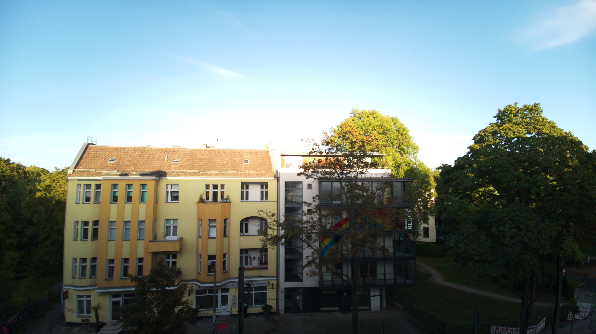
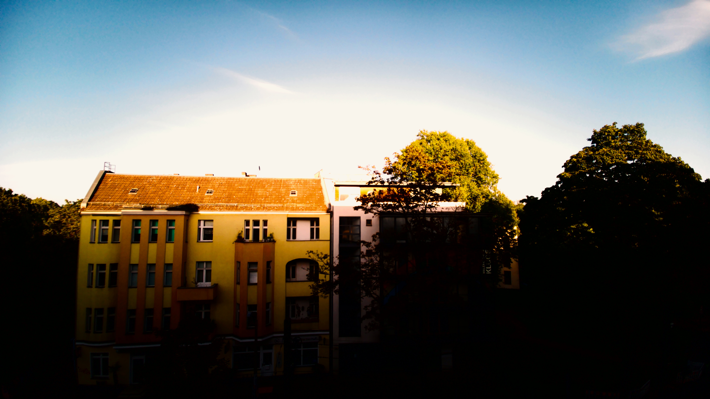
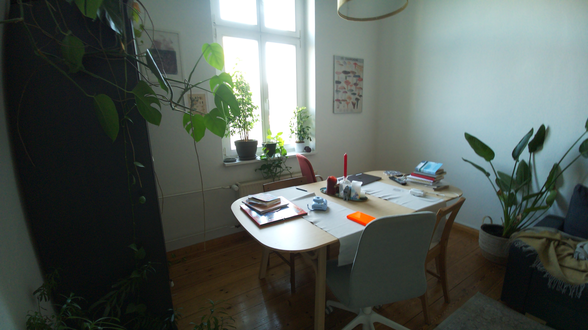
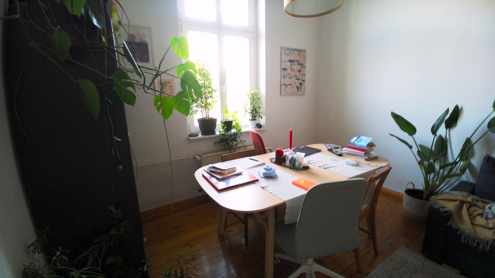

# Introduction
This entire idea took shape from trying to find a kid friendly camera for my son, which is a little more than potato quality, is made of decent plastic, modular and cheap.

The prototype phase is still in progress, the repo is super messy hence I'm experimenting with various hardware, software, and photo grading techniques.


# Pi Film Reversal

One experiment in pushing the Raspberry Pi camera to recreate film and
photographic looks with machine learning: it learns a 3D-LUT colour grade from
a set of reference photographs, then applies it on-device at capture time.

The bundled look is a **handcrafted, untrained starter preset**; no reference
photographs were used to train that preset. Separately, the local
`artifacts/personal-collection-01-v1/` model was trained on 150 curated references
and passed all five numerical validation gates. See
[the training guide](docs/training.md) for how a run works and what the gates mean.
It remains experimental and proxy-trained, not calibrated to the Raspberry Pi
camera. Artifacts and training data are gitignored and are not included in a clone.

To test this trained model after installing the package, explicitly select it:

```bash
pifilm-process /path/to/ungraded-photos /path/to/results \
  --artifacts artifacts/personal-collection-01-v1
```

Without `--artifacts`, commands continue to use the untrained starter preset.

## Sample results

Photos captured on the Raspberry Pi with the Camera Module 3 Wide (IMX708),
the ungraded original on the left and the graded `_graded.jpg` on the right.

| Original | Martin Parr look |
| --- | --- |
|  |  |
|  |  |

## Hardware
- Raspberry Pi 3B, 1GB RAM (too slow for 12 MP post process)
- Raspberry Pi 4, 4GB RAM (In testing)
- M5Stack StickS3 (display, trigger)
- Waveshare 2.8 inch LCD Display Module (In testing)
- x728 UPS Shield + Geekworm X728-C1 Metal Case (Using it for outdoor photos)
- 64GB SD Card
- Arducam 8-50mm C-Mount Zoom Lens for IMX477 (In testing)
- Raspberry Pi Camera Module 3, Wide, IMX708 sensor (default mount for now)

## Getting started

Full walkthrough: **[the setup guide](docs/setup.md)** — ordered by dependency,
and it names the machine for every step. In brief:

| # | Machine | Step |
| --- | --- | --- |
| 1 | Mac | clone, venv, `pip install -e '.[train,dev,deploy]'`, PlatformIO, tests |
| 2 | — | fill the one `.env` (all credentials/addresses; used by deploy, hotspot and firmware) |
| 3 | Pi | OS (Trixie), hostname, Ethernet admin, then the Pi's own Wi-Fi hotspot |
| 4 | Pi | app + service: venv with system OpenCV, choose a look, token file, systemd unit |
| 5 | Stick | build + flash with credentials baked in, read the serial log |
| 6 | Mac (opt) | training — only to replace the bundled starter |

More detail lives in the docs: the [network & deployment guide](docs/sticks3-remote.md)
(hotspot, Ethernet, service, rollback) and the [firmware README](firmware/sticks3/README.md)
(Stick build, serial log, proving the displayed photo is the graded one).

| Ready to capture | Last captured photo |
| --- | --- |
|  |  |

> **Never** put a real token, Wi-Fi password, or Pi SSH password in a command,
> source file, or commit — `.env` is gitignored for that reason.

## From button press to displayed photo

The Pi captures, grades and stores. The M5Stack StickS3 is the wireless shutter
and **last-capture display** — not a live viewfinder. It joins the Pi's own
Wi-Fi hotspot and they talk over a token-authenticated HTTP API, so no home
network or cloud is needed in the field. Ethernet/SSH is only for admin and
photo transfer, never the shutter.

```text
Stick joins hotspot → checks readiness → shows READY
    ↓ button press
POST /v1/captures → Pi accepts (one at a time) → Stick sounds shutter
    ↓ colour bars while waiting
Pi grabs one frame → normalize → LUT → grain
    ↓
Pi saves original + graded JPEG + captures.jsonl → job complete
    └─ Stick polls, downloads the graded thumbnail, displays it
```

- **Ready** — the Pi app runs with its remote listener; the Stick joins the
  hotspot and polls `GET /v1/status` before showing READY.
- **Shutter** — a debounced press sends `POST /v1/captures` with a unique ID. The
  Pi runs one capture at a time (extra requests get a busy `409`); the shutter
  tone means "accepted", not "saved".
- **Feedback** — the Stick shows colour bars and polls `GET /v1/captures/{id}`
  while it works (two-screen mode shows the same bars on the Pi).
- **Capture + grade** — one frame becomes both outputs: normalize → chosen 3D LUT
  → grain. `--artifacts DIR` picks a different look.
- **Save** — to `~/Pictures/pifilm/YYYY-MM-DD/`: `*_original.jpg` (or
  `*_ungraded.jpg`), the full-res `*_graded.jpg`, and a `captures.jsonl` line (LUT
  hash, gains, grain seed, timings). The job completes only after these writes.
- **Preview to Stick** — the Stick fetches `GET /v1/captures/{id}/image.jpg`; the
  Pi returns a 240×135, ≤64 KiB letterboxed JPEG of the graded file. No
  re-grading on the Stick.
- **Display** — shown until the next capture. Full-res stays on the Pi (the Stick
  isn't the archive); failures show an error, not a fake success.

**Running modes:**

| Mode | Command | Notes |
| --- | --- | --- |
| Headless (field) | `pifilm-capture --no-preview --remote-listen 0.0.0.0:8765` | battery, no monitor; the Stick still gets the preview |
| Two-screen | `pifilm-capture --show-captures` | run in a Pi desktop session; the Pi also shows colour bars + the graded photo |

Full config and rollback: the [deployment guide](docs/sticks3-remote.md).

## Using the tools directly

```bash
pifilm-process /path/to/originals /path/to/results   # batch re-grade a folder
pifilm-capture --no-preview --show-captures          # capture on the Pi
```

Capture modes:

| Flag | Behaviour |
| --- | --- |
| `--show-captures` | fullscreen window; `SPACE` grades a shot (colour bars while it works) and shows it until the next; `Q`/Esc quits |
| `--no-preview` | terminal controls, no window |
| `--fake` | synthetic frames, no camera (for testing) |
| `--device /dev/videoN` | select a specific USB camera |

Output lands in `~/Pictures/pifilm/YYYY-MM-DD/`: `*_original.jpg` (or
`*_ungraded.jpg`), `*_graded.jpg`, and a `captures.jsonl` line. The USB (V4L2)
path captures a 1920×1080 MJPEG stream at 30 fps; window size does not change
capture resolution.

### Camera backends

`--camera` picks the backend. With no flag, `--device` implies `v4l2`; otherwise
Picamera2 is used when it imports, falling back to V4L2. Picamera2 and libcamera
come from Raspberry Pi OS apt (never pip), so the venv uses `--system-site-packages`.

| Command | What it captures |
| --- | --- |
| `pifilm-capture --camera v4l2 --device /dev/video0` | USB (UVC) camera at 1920×1080 |
| `pifilm-capture --camera picamera2 --tuning-file imx708_wide.json` | Pi Camera Module 3 (IMX708) at native 4608×2592 |

> Once Picamera2 is installed it becomes the default, so a Pi still on the USB
> camera must pass `--camera v4l2` until it is migrated. First-time bring-up
> (`rpicam-hello --list-cameras`, an RGB patch check, dimensions and metadata) is
> in [the Picamera2 bring-up checklist](docs/picamera2-bringup.md).

**Picamera2 saves three files** per shot (two on V4L2):

- `*_original.jpg` — the ISP's own full-quality render (always this name).
- `<stem>.dng` — raw sidecar from the same frame (~18 MB; ~28 MB/shot total).
- `*_graded.jpg` — the graded result.

`captures.jsonl` also records `camera_metadata` (`ExposureTime`, `AnalogueGain`,
`Lux`, `LensPosition`, `AfState`, …) and the `dng` filename when present.

Capture flags:

| Flag | Action |
| --- | --- |
| `--autofocus {continuous,auto,manual}` | autofocus mode (default `continuous`) |
| `--af-range {normal,macro,full}` | autofocus range (default `normal`) |
| `--no-dng` | skip the raw sidecar for long sessions (keeps `_original.jpg`) |
| `--ae-lock` / `--awb-lock` / `--colour-gains R,B` | lock exposure / white balance for controlled reference shoots |

There is no flash, so exposure and white balance stay auto by default; the lock
flags are only for controlled, reference-matching shoots.

The preset increases midtone color and contrast with a smooth tone curve,
compresses out-of-gamut chroma, and adds subtle grain (`0.004`). Rebuild it with:

```bash
.venv/bin/pifilm-preset --out artifacts/starter-v1
```

Pass `--highlights 0.6` to hold coloured highlights back from clipping; `0`
(the default) is the current look.

## Archiving photos to Nextcloud

Optional off-device backup: the Pi pushes everything under `~/Pictures/pifilm`
to a Nextcloud folder with `rclone copy` over WebDAV (the rsync-equivalent for
Nextcloud — plain `rsync` can't talk to it).

How it behaves:

- **Copy, never delete** — only adds/updates on Nextcloud, so cleaning the Pi's
  SD card never removes the cloud copies.
- **No-op off the wired LAN** — each run exits at once unless `eth0` has a
  home-LAN IP and Nextcloud answers a TCP connect, so a frequent timer is cheap.
- **Password never in argv** — read from `.env`, obscured with `rclone obscure`,
  passed via `RCLONE_CONFIG_*` env vars (never a command line or a config file).
- **Incremental** — syncs the originals, `_graded.jpg`, `.dng` raws and
  `captures.jsonl`, skipping anything already uploaded.

Scheduling is a **systemd timer, not cron**: `pifilm-nextcloud-sync.timer` runs
the oneshot a few minutes after boot, then every 15 min (`OnUnitActiveSec=15min`,
`Persistent=true`). Nothing runs until you install and enable it.

Setup, on the Pi:

```bash
sudo apt install rclone                                # one-time
# then fill NEXTCLOUD_* in .env — use a Nextcloud app password, not your login

.venv/bin/python scripts/nextcloud_sync.py --env .env          # dry run (no transfer)
.venv/bin/python scripts/nextcloud_sync.py --env .env --apply  # real copy

# enable the 15-minute timer (drops the .example suffix)
sudo cp deploy/pifilm-nextcloud-sync.service.example /etc/systemd/system/pifilm-nextcloud-sync.service
sudo cp deploy/pifilm-nextcloud-sync.timer.example   /etc/systemd/system/pifilm-nextcloud-sync.timer
sudo systemctl daemon-reload
sudo systemctl enable --now pifilm-nextcloud-sync.timer
systemctl list-timers pifilm-nextcloud-sync.timer      # confirm NEXT / LAST
```

Full guide (app password, every key, troubleshooting): [docs/nextcloud-sync.md](docs/nextcloud-sync.md).

## Training a reference-derived look

Training is optional; the camera works with the bundled starter.
[The training guide](docs/training.md) is the step-by-step procedure: how a run
works, collecting camera frames, curating references, training, reading the
report gate by gate, iterating without fooling yourself, deploying to the Pi and
writing the run down. [The setup guide, section 6](docs/setup.md#6-training-a-look-optional)
has the short outline. The policy that applies to every reference photograph:

Use photographs credited to Martin Parr from the supplied Magnum and Aperture
sources, his official site, Foundation and publishers. Fan-submission Flickr
groups are excluded. See [the reference guide](docs/reference-sources.md) for
additional sources, curation notes and the difference between visual research
and training files. Use reference files you have permission to use. The project
takes local image folders; it does not scrape Parr's website or assume that
photos *of* Parr are photos *by* him. The optional `pifilm-fetch --category
'Category:...'` command downloads an explicitly chosen Wikimedia Commons
category, retaining licence metadata; that is a generic corpus utility, not a
ready-made Parr reference set.

Training fits a 33³ RGB lookup table via color-distribution transfer and smooth
least squares. It splits by image, evaluates held-out data, and produces
`pifilm.cube`, `params.json`, and a report with contact sheets, tone ramps, metrics
and quality gates. A LUT models global color and tone, not subjects,
composition, focus or lighting geometry. The dated reports in `docs/` record
what past runs produced; `todo.md` section 1 records what is needed for better
results.

## How the colour model works

There is no neural network in this project. The "model" is a 33 × 33 × 33
colour lookup table, the same `.cube` format that DaVinci Resolve or Photoshop
would open, fitted with classical colour statistics: distribution matching,
regularised least squares and a handful of safety checks. The training data is a
few hundred images with no pairs between
camera frames and reference photographs, and the result has to run on a
Raspberry Pi 4 with no machine-learning runtime installed.

### At capture time, on the Pi

Every graded frame goes through three steps, in a fixed order, in
`pifilm/pipeline.py`:

1. **Normalisation** (`pifilm/normalize.py`). Per-frame white balance and an
   exposure or levels correction, computed in linear light and applied to
   the luma channel only, so contrast changes do not inflate saturation. It
   compiles into three 256-entry tables plus one for tone, applied with
   OpenCV's `LUT` and two `cvtColor` calls: about 100 ms for 1080p on the Pi.
   The same code, in floating point, prepared every training image, so the LUT
   sees the input distribution it was fitted on.
2. **The 3D LUT** (`pifilm/lut.py`). Trilinear interpolation over the 35,937
   nodes, executed by Pillow's `ImageFilter.Color3DLUT` in C with 16-bit fixed
   point. A NumPy reference implementation exists for tests and the trainer.
3. **Grain** (`pifilm/grain.py`). Gaussian noise on luminance only, blurred by
   `blur_sigma` so it clumps like film rather than looking like sensor noise,
   scaled by `4Y(1 − Y)` so it vanishes in deep shadow and blown highlights.
   The seed is recorded per capture, so any graded file can be regenerated
   from its original.

### At training time, on the Mac

`pifilm-train` (`pifilm/train/`) turns two folders of images into that LUT:

1. **Corpus building** (`dataset.py`). Each corpus is split **by image**
   before any pixel is sampled, 20 % held out. Every image is oriented from
   EXIF, colour-managed to sRGB from its embedded ICC profile, cropped 6 % per
   edge, downscaled to 512 px, normalised, and sampled: 3000 pixels per image,
   capped at 400,000 per pool, kept only where Oklab lightness lies in
   (0.02, 0.98).
2. **Oklab** (`color.py`). All statistics are computed in Oklab, Björn
   Ottosson's perceptual space, so "match the distribution" means "match what
   the eye sees" and hue angles behave in the blues.
3. **Hue reweighting** (`transport.py`). The two corpora show different
   subjects. Target pixels are reweighted across 24 hue bins so the target's
   hue histogram matches the source's, which removes the largest content bias.
   Weights are clipped to 0.2 to 5, so this is a heuristic, and the residual
   is published in the report.
4. **Iterative Distribution Transfer** (Pitié, Kokaram and Dahyot, 2005).
   Forty rounds of: pick a random 3D rotation, project both pixel clouds onto
   its axes, match the source's marginal to the weighted target's along each
   axis by quantile mapping, rotate back. Each source pixel ends up with a
   partner colour in the target distribution. `--strength` blends between the
   original and the moved colour, and may extrapolate up to 2.
5. **LUT fit** (`lutfit.py`). A trilinear LUT is linear in its node values, so
   fitting is ordinary least squares with a sparse design matrix of eight
   non-zeros per pixel. Two regularisers are added: a second-difference
   smoothness term along all three grid axes, and an identity term that holds
   nodes no source pixel ever touched in place (71 % of the cube, in the first
   real fit). The normal equations are solved with SciPy's conjugate-gradient
   solver and a Jacobi preconditioner. A neutral-axis cap limits tint on greys,
   and monotonicity is then enforced exactly with SciPy's isotonic regression.
6. **Evaluation** (`evaluate.py`). The headline metric is a **sliced
   Wasserstein distance** from the graded held-out source pixels to the target
   cloud, using 256 fixed random projections and fixed samples so "before" and
   "after" differ only by the LUT. It is repeated over five seeds and the
   spread reported, so an improvement can be compared against noise. Five
   gates then pass or fail with thresholds fixed before any tuning:
   improvement above three times the seed spread, grey axis monotone, each
   channel monotone, neutral input staying neutral, and the cube interior off
   the gamut boundary.
7. **Report and publish** (`report.py`, `artifacts.py`). Contact sheets of
   held-out frames, tone ramps, normalisation diagnostics and `metrics.json`,
   then an atomic swap of the finished artifact into place so a crash can never
   leave a new LUT beside old parameters.

The full procedure, from an empty `data/` folder to a verified deployment, is
[the training guide](docs/training.md).

### Libraries

| Library | Where | What it does here |
|---|---|---|
| NumPy | everywhere | All array maths: colour conversions, sampling, transport, evaluation |
| Pillow | runtime and trainer | Image I/O, EXIF orientation, ICC conversion (`ImageCms`), the `Color3DLUT` filter, `.cube` round-trips, contact sheets |
| OpenCV (`cv2`) | runtime and trainer | Colour-space conversions, the 256-entry `LUT` tables, Gaussian blur for grain, resizing, and V4L2 camera capture on the Pi |
| SciPy | trainer only | Sparse matrices, the conjugate-gradient solver, isotonic regression |
| requests, tqdm | `pifilm-fetch` only | Wikimedia Commons downloads with licence checks |
| smbus2, gpiozero | Pi only, `--ups x728` | Reading the UPS fuel gauge over I2C and the power-loss pin |
| Paramiko | Mac only, deploy script | SSH to the Pi with a reject-unknown-hosts policy |
| pytest, ruff, build | development | Tests, lint, wheel build |

Not used: PyTorch, TensorFlow, scikit-learn, or any GPU. Nothing is downloaded
at runtime and no data leaves the machine.

### Dependencies by role

`pyproject.toml` keeps the base install small and puts the rest behind extras:

| Install | Pulls in | Who needs it |
|---|---|---|
| `pip install -e .` | NumPy, Pillow | The Pi, which gets OpenCV from apt |
| `.[opencv]` | + `opencv-python` | Any non-Pi machine that runs the pipeline |
| `.[train]` | + SciPy, requests, tqdm, `opencv-python` | The Mac, for `pifilm-train` and `pifilm-fetch` |
| `.[deploy]` | + Paramiko | The Mac, for `scripts/deploy_remote.py` |
| `.[dev]` | + pytest, ruff, build, `opencv-python` | Anyone running the tests |

On the Pi, `python3-opencv`, `python3-numpy` and `python3-pil` come from apt
and the venv is created with `--system-site-packages`, because the apt OpenCV
is built with GTK for the two-screen mode and the pip wheel is not; `smbus2`
and `gpiozero` are preinstalled on Raspberry Pi OS. OpenCV is imported through
one guard, `pifilm/_cv2.py`, which explains the right fix when it is missing.

### What a LUT cannot do

It maps each input colour to one output colour, everywhere in the frame. It
cannot add flash lighting, local contrast, sharpness or depth, and it cannot
invent colour: an unlit grey room comes out grey through every LUT, as measured
in `todo.md` section 1. Those limits, and the roadmap for better fits, are the
subject of the next section and of the training guide.

## The look and its limits

Parr's [own FAQ](https://martinparr.com/faq/) describes consumer films including
Agfa Ultra and Fuji 100 with ring flash, and Fuji 400 in medium format. This
project's low-ISO, fine-grain target is an aesthetic choice, not a claim that all
his work used one film or ISO. His saturated color depends partly on flash:
capture with direct or ring flash and appropriate exposure when possible.
A LUT cannot add the corresponding highlights, shadows or depth cues afterward.

See [ORIGIN.md](ORIGIN.md) for the code's starting point and what is independent.
