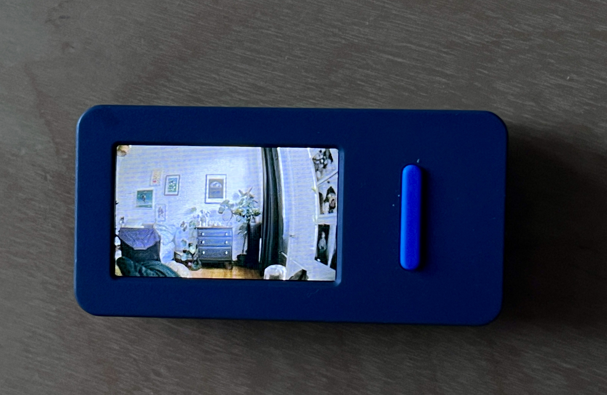
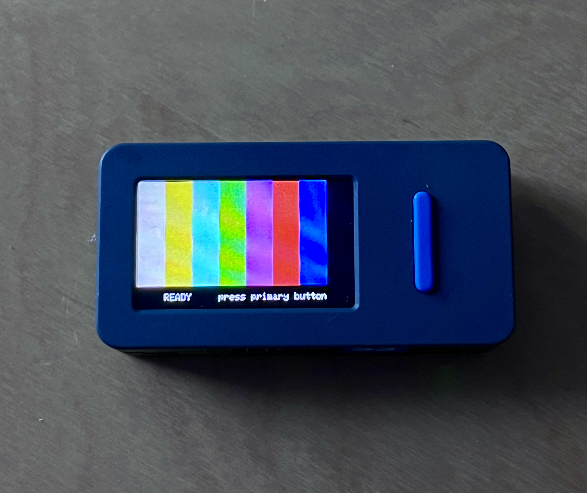

# Introduction
This entire idea took shape from trying to find a kid friendly camera for my son, which is a little more than potato quality, is made of decent plastic, modular and cheap.

The prototype is still in progress but I'm aiming at a handheld point and shoot with the M5Stack Stick S3 used as the viewfinder along the Raspberry Pi3 and the Innomaker low light camera module for start.

Once the prototype is working as expected, additional parts would include a proper 3D printed case, and potential upgrade to the Raspi high quality camera module and external battery HAT.


# Martin Parr Look

A color-grading experiment inspired by Martin Parr's saturated,
flash-lit color-negative photographs: vivid reds, yellows and blues, crisp
contrast, neutral whites, and fine grain. Runs on a Mac for training and a
Raspberry Pi for capture, using the learned 3D-LUT approach from `kodachrome-film`.

The bundled look is a **handcrafted, untrained starter preset**; no reference
photographs were used to train that preset. Separately, the local
`artifacts/personal-collection-01-v1/` model was trained on 150 curated references
and passed all five numerical validation gates. See the
[personal-collection training report](docs/training-personal-collection-01-v1.md).
It remains experimental and proxy-trained, not calibrated to the Raspberry Pi
camera. Artifacts and training data are gitignored and are not included in a clone.

To test this trained model after installing the package, explicitly select it:

```bash
parr-process /path/to/ungraded-photos /path/to/results \
  --artifacts artifacts/personal-collection-01-v1
```

Without `--artifacts`, commands continue to use the untrained starter preset.

## Hardware
- Raspberry Pi 3B, 1GB RAM
- M5Stack StickS3 (display, trigger)
- 64GB SD Card
- Innomaker 1080P USB2.0 UVC Camera, 121° Lens, PS5268 Sensor

## Setup

Mac (Python 3.11 or newer):

```bash
cd ../martin-parr-project
python3.12 -m venv .venv
.venv/bin/python -m pip install --upgrade pip
.venv/bin/python -m pip install -e '.[train,dev]'
.venv/bin/pytest -q -m 'not slow'
```

Raspberry Pi OS with a desktop:

```bash
sudo apt install python3-venv python3-opencv python3-numpy python3-pil
python3 -m venv --system-site-packages .venv
.venv/bin/python -m pip install --upgrade pip
.venv/bin/python -m pip install -e .
```

Use the Pi's system OpenCV for its GTK display support. Training additionally
needs the `train` dependencies; normally train on the Mac and copy the artifact
folder to the Pi.

## StickS3 remote capture on the Pi

The StickS3 and Pi deployment uses a local `.env` that is intentionally ignored
by Git. Copy `.env.example` to `.env`, fill in the real credentials locally, and
follow [the Pi and StickS3 deployment guide](docs/sticks3-remote.md). The guide
covers the two-screen desktop mode and the Stick-only headless service; do not
put a real token, Wi-Fi password, or Pi SSH password in a command, source file,
or commit.

| Last captured photo | Ready to capture |
| --- | --- |
|  |  |

## From button press to displayed photo

The Raspberry Pi does the capture, grading and storage. The M5Stack StickS3 is
the wireless shutter button and **last-capture display**, not a live viewfinder.
Both devices communicate over the local LAN using a token-authenticated HTTP API;
SSH is used for deployment/administration, not for each shutter press. No cloud
service is involved in this capture flow.

```text
Stick joins Wi-Fi → checks Pi readiness → displays READY
    ↓ primary button press
Capture request → Pi accepts → Stick sounds shutter acknowledgement
    ↓ TV colour bars while waiting
Pi acquires one camera frame → normalizes → applies LUT → adds grain
    ↓
Pi saves original + graded JPEG + capture log → marks job complete
    ├─ Optional Pi screen displays the saved graded photo
    └─ Stick polls completion → downloads graded thumbnail → decodes → displays
```

1. **Connect and become ready.** The Pi capture app must be running with its
   remote listener enabled. The Stick connects to Wi-Fi and checks the Pi's
   status before showing that it is ready for another capture.
2. **Request one snapshot.** A debounced primary-button press creates a unique
   request ID and sends `POST /v1/captures`. The Pi accepts only one active
   capture at a time; additional requests can be rejected as busy. The Stick's
   shutter tone acknowledges an accepted request—it does not mean grading or
   saving has finished.
3. **Show processing feedback.** The Stick shows TV colour bars while submitting,
   processing and downloading. It polls `GET /v1/captures/{id}` for that same
   capture, rather than taking another photo while waiting. In two-screen mode,
   the Pi also shows processing colour bars during capture and grading.
4. **Capture and grade on the Pi.** One newly acquired USB-camera frame supplies
   both the original and the graded output. The pipeline applies configured
   white-balance and exposure/levels normalization, the selected 3D LUT, then
   optional fine grain. The bundled starter is the default; `--artifacts DIR`
   explicitly selects another LUT and its associated normalization/grain settings.
5. **Save locally before declaring completion.** By default, the Pi writes to
   `~/Pictures/parr/YYYY-MM-DD/`: the original camera JPEG as `*_original.jpg`
   when available, otherwise an encoded `*_ungraded.jpg`; the full-resolution
   graded `*_parr.jpg`; and an entry in `captures.jsonl`. The log records file
   names, timestamp, LUT hash, normalization gains, grain seed, camera stream
   settings and processing timings. The job is marked complete after these writes
   succeed.
6. **Transfer a graded preview to the Stick.** After completion, the Stick requests
   `GET /v1/captures/{id}/image.jpg`. The Pi reads that job's saved **`*_parr.jpg`**
   and generates an aspect-preserving **240 × 135 JPEG**, with black padding if
   needed and a **64 KiB** transfer limit. This is a download initiated by the
   Stick, not a push/upload of the full-resolution file. Grading is not repeated
   on the Stick, and the ungraded file is not used for this endpoint.
7. **Display until the next snapshot.** The Stick decodes the JPEG and displays
   it from memory. In normal operation it stays visible until the next capture
   starts. The full-resolution files remain on the Pi; the Stick display is not
   the photo archive. Network or capture failures show a status/error instead of
   being treated as a successful new photo.

For battery-powered **headless use**, run with `--no-preview`, enable the remote
listener, and omit `--show-captures`. The Stick still receives the graded preview;
the Pi does not need a connected monitor or a display window. For **two-screen
use**, add `--show-captures` in a working Pi desktop session. See the
[deployment guide](docs/sticks3-remote.md) for the complete configuration and
service commands.

## Try the starter look

```bash
.venv/bin/parr-process /path/to/originals /path/to/parr-results
.venv/bin/parr-capture --no-preview --show-captures
```

`SPACE` shows TV color bars while a snapshot is captured and processed, then
displays the graded photo until the next capture. `Q` or Escape exits. Fullscreen
display fits the image without cropping or stretching. Plain `--no-preview`
uses terminal controls without a window; `--fake` uses synthetic camera frames.

Captures go to `~/Pictures/parr/YYYY-MM-DD/`: the camera JPEG is saved verbatim
as `*_original.jpg` when available, otherwise `*_ungraded.jpg`, alongside
`*_parr.jpg` and `captures.jsonl`. These commands and outputs are separate from
the Kodachrome project. Capture currently requests a 1920 × 1080 MJPEG stream at
30 fps, inherited from that project; display resolution does not change capture
resolution. Use `--device` to select the camera.

The preset increases midtone color and contrast with a smooth tone curve,
compresses out-of-gamut chroma, and adds subtle grain (`0.004`). Rebuild it with:

```bash
.venv/bin/parr-preset --out artifacts/starter-v1
```

## Train a reference-derived look

Create `data/source/` for ungraded camera photos and `data/references/` for the
finished reference photographs. Aim for at least 30 source images (50+ is better)
and 200 references spanning skin, food, signage, beaches, interiors and neutrals.
Use one coherent visual period; mixing early monochrome, muted scans and later
digital work gives the trainer contradictory targets. Avoid duplicates and
near-duplicates across the held-out split.

Use photographs credited to Martin Parr from the supplied Magnum and Aperture
sources, his official site, Foundation and publishers. Fan-submission Flickr
groups are excluded. See [the reference guide](docs/reference-sources.md) for
additional sources, curation notes and the difference between visual research
and training files.

Use reference files you have permission to use. The project takes local image
folders; it does not scrape Parr's website or assume that photos *of* Parr are
photos *by* him. The optional `parr-fetch --category 'Category:...'` command
downloads an explicitly chosen Wikimedia Commons category, retaining licence
metadata. It defaults to public-domain files; that is a generic corpus utility,
not a ready-made Parr reference set.

```bash
.venv/bin/parr-train --source data/source --target data/references --out artifacts/parr-v1
.venv/bin/parr-process /path/to/test-originals /path/to/test-results --artifacts artifacts/parr-v1
.venv/bin/parr-capture --no-preview --show-captures --artifacts artifacts/parr-v1
```

Training fits a 33³ RGB lookup table via color-distribution transfer and smooth
least squares. It splits by image, evaluates held-out data, and produces
`parr.cube`, `params.json`, and a report with contact sheets, tone ramps, metrics
and quality gates. Exit code 3 means an artifact was written but a gate failed;
inspect `report/summary.txt` before using it. A LUT models global color and tone,
not subjects, composition, focus or lighting geometry.

Target white balance and levels stretching are off by default; exposure matching
still aligns reference brightness. Camera inputs receive the same normalization
in training and capture. `--target-levels` opts into reference levels stretching.
`--strength 0.8` weakens a learned grade; `--grain-strength 0` disables added grain.
`--allow-small` permits exploratory small-corpus fits and marks unavailable
held-out evaluation; `--proxy-source` records stand-in photos instead of actual
camera samples. A small test run does not establish a successful visual match.

## The look and its limits

Parr's [own FAQ](https://martinparr.com/faq/) describes consumer films including
Agfa Ultra and Fuji 100 with ring flash, and Fuji 400 in medium format. This
project's low-ISO, fine-grain target is an aesthetic choice, not a claim that all
his work used one film or ISO. His saturated color depends partly on flash:
capture with direct or ring flash and appropriate exposure when possible.
A LUT cannot add the corresponding highlights, shadows or depth cues afterward.

See [ORIGIN.md](ORIGIN.md) for the code's starting point and what is independent.
