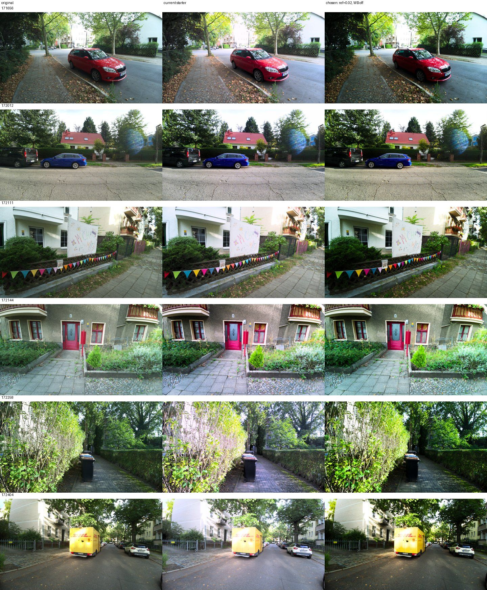

# IMX708 normalisation candidates — 2026-09-19

This experiment picks the frozen normalisation for the bundled starter
(Phase 6 of the [IMX708 roadmap](../superpowers/plans/2026-09-11-rpi4-imx708-roadmap.md),
[design](../superpowers/specs/2026-09-19-phase6-normalisation-design.md)). It
measures, on real IMX708 pilot photos, whether the clipping-aware highlight
lift (`levels_lift_highlight_ref`) and turning source white balance off stop
the normaliser from lifting already-clipped frames further, and it selects
the values frozen into `pifilm/data/params.json`.

## Question

The 108-shot pilot showed two problems with the bundled starter's
normalisation on Picamera2/IMX708 frames (full numbers in the
[design doc](../superpowers/specs/2026-09-19-phase6-normalisation-design.md#problem-as-measured)):
outdoor shots got a strong tone lift (median gamma 0.577) while already
clipped, and a second, redundant grey-world white balance pushed blue up to
1.6x on frames the ISP's AWB had already balanced. Does capping the lift by
the fraction of pixels at the ceiling, and disabling the source-side white
balance, fix both without changing how good the indoor shots already look?

## Method

`pifilm/experiments/normalisation.py`, run against the 108-shot pilot capture
folder, evaluating the bundled starter's LUT with every combination of
candidate `levels_lift_highlight_ref` and white balance on/off:

```sh
.venv/bin/python -m pifilm.experiments.normalisation \
  --source source_imx708/2026-09-19 \
  --no-wb \
  --shots 171656,172012,172111,172144,172258,172404 \
  --out data/phase6-normalisation-eval
```

`--refs` defaults to `0.02,0.05,0.10` (evaluated alongside the current,
undamped behaviour); `--no-wb` doubles every candidate with
`white_balance=False`; `--shots` pins the six shots discussed in the design
doc onto the contact sheet in addition to six random samples (`--sample 6`,
default). For every original x candidate, the pipeline normalises with that
candidate's `NormalizeParams`, applies the bundled starter's LUT, and never
applies grain, so only normalisation differs between columns; originals are
downscaled to 1536 px on the long side (`--max-side`, default) before
grading, for speed. Indoor/outdoor is split by `camera_metadata.Lux > 1500`
from `captures.jsonl` recorded alongside the originals.

Metrics, on the graded 8-bit output, per shot: `clip_pct` (pixels with any
channel >= 254), `p1_luma`/`p5_luma` (BT.709 luma percentiles), and the
applied `gamma`/`wb_blue`/`highlight_frac`/`lift_weight`. Aggregates: mean and
median `clip_pct`, count of shots with `clip_pct > 1%`, median
`p1_luma`/`p5_luma`, and the gamma distribution (min/median/max).

## Results

### Aggregate tables

All figures are medians unless noted; full output in `report.md` under the
gitignored `--out` directory (not committed).

| Candidate | Split (n) | Median gamma | Median clip% | Median p5 luma |
| --- | --- | ---: | ---: | ---: |
| current (today's behaviour) | all (108) | 0.750 | 4.566 | 0.0812 |
| current | outdoor (31) | 0.577 | 12.051 | 0.1704 |
| current | indoor (77) | 0.764 | 2.836 | 0.0779 |
| ref=0.02 | all (108) | 1.000 | 3.865 | 0.0326 |
| ref=0.02 | outdoor (31) | 1.000 | 9.469 | 0.0370 |
| ref=0.02 | indoor (77) | 0.976 | 2.551 | 0.0322 |
| ref=0.05 | all (108) | 0.873 | 4.144 | 0.0462 |
| ref=0.05 | outdoor (31) | 1.000 | 9.708 | 0.0415 |
| ref=0.05 | indoor (77) | 0.856 | 2.746 | 0.0468 |
| ref=0.10 | all (108) | 0.814 | 4.325 | 0.0605 |
| ref=0.10 | outdoor (31) | 0.845 | 11.012 | 0.0656 |
| ref=0.10 | indoor (77) | 0.810 | 2.799 | 0.0591 |
| current+nowb | all (108) | 0.753 | 3.696 | 0.0796 |
| current+nowb | outdoor (31) | 0.577 | 9.253 | 0.1700 |
| current+nowb | indoor (77) | 0.765 | 2.308 | 0.0779 |
| **ref=0.02+nowb (chosen)** | all (108) | 1.000 | 3.178 | 0.0323 |
| **ref=0.02+nowb (chosen)** | outdoor (31) | 1.000 | 8.167 | 0.0367 |
| **ref=0.02+nowb (chosen)** | indoor (77) | 0.975 | 2.079 | 0.0317 |
| ref=0.05+nowb | all (108) | 0.872 | 3.391 | 0.0459 |
| ref=0.05+nowb | outdoor (31) | 1.000 | 8.167 | 0.0417 |
| ref=0.05+nowb | indoor (77) | 0.856 | 2.203 | 0.0459 |
| ref=0.10+nowb | all (108) | 0.812 | 3.476 | 0.0593 |
| ref=0.10+nowb | outdoor (31) | 0.837 | 8.689 | 0.0659 |
| ref=0.10+nowb | indoor (77) | 0.811 | 2.254 | 0.0588 |

Current, undamped: 53 of 108 shots were lifted while already clipped (see the
design doc). With `ref=0.02+nowb`, outdoor median gamma goes from 0.577 to
1.00 (no lift) and outdoor median clip% roughly halves (12.1% -> 8.2%);
indoor median gamma barely moves (0.764 -> 0.975) and indoor clip% actually
falls a little, because turning white balance off also removes some
blue-channel clipping.

### Named shots (current -> chosen: `ref=0.02+nowb`)

Gamma / clip% / p5 luma:

| Shot | Current gamma/clip%/p5 | Chosen gamma/clip%/p5 |
| --- | --- | --- |
| 172404 | 0.59 / 10.8 / 0.204 | 1.00 / 8.7 / 0.054 |
| 172258 | 0.65 / 10.9 / 0.137 | 1.00 / 4.4 / 0.039 |
| 171656 | 0.70 / 10.4 / 0.093 | 1.00 / 7.9 / 0.028 |
| 172111 | 0.74 / 5.9 / 0.086 | 1.00 / 3.8 / 0.031 |
| 172012 | 0.92 / 11.7 / 0.055 | 1.00 / 11.6 / 0.039 |
| 172144 | 0.97 / 2.1 / 0.109 | 0.98 / 2.1 / 0.107 |

`172404` and `172258` were the two shots the user judged worst under the
current behaviour (design doc: the strongest gamma lift combined with the
strongest blue push, up to 1.6x). Both drop their tone lift to identity and
lose most of their extra clipping. `172144`, an already well-behaved indoor
shot, is essentially unchanged, which is the "leave good indoor shots alone"
property working as intended.



Columns: original | current starter | chosen (`ref=0.02`, white balance off).

## Decision

**Frozen: `levels_lift_highlight_ref=0.02`, `white_balance=False`.** The user
chose `ref=0.02` over the candidate `ref=0.05` that the design doc's proposed
selection rule would have picked (the smallest ref that brings outdoor clip%
down to the indoor level while leaving indoor gamma unchanged within 0.02).
At `ref=0.05+nowb`, outdoor gamma is 1.00 (same as 0.02) but indoor median
gamma drops further, to 0.856 vs. 0.02's 0.975 — a visible loss of indoor
lift for shots that were already good. The trade-off actually made: **prefer
outdoor fidelity (no unwanted lift on bright frames) over preserving as much
of the indoor lift as the selection rule would keep**; `ref=0.02` gives
almost all of the outdoor clipping reduction `ref=0.05` gives, at a much
smaller cost to indoor gamma.

White balance off removes the ISP-on-top-of-grey-world double correction
(D2 in the design doc) with no measurable cost to indoor neutrals in this
set.

## What this does not fix

Residual outdoor clipping under the chosen candidate (roughly 8-10% median)
is **in-camera**: it is present in the original before any normalisation runs
(`171656`'s centre-weighted AE metered the shaded foreground and blew the
bright house and sky in the original itself — see the design doc). The
normaliser can dampen a *lift into* clipping; it cannot un-clip pixels that
were already saturated at capture. That is what the new capture-side
`--ae-constraint highlight` flag targets (see the
[README](../../README.md#camera-backends) and
[picamera2-bringup.md](../picamera2-bringup.md), section 4):
a follow-up hardware shot of a 171656-type strong-light scene with
`--ae-constraint highlight` is still needed to confirm it protects the
original's highlights.

## Reproduce

```sh
.venv/bin/python -m pifilm.experiments.normalisation \
  --source source_imx708/2026-09-19 \
  --no-wb \
  --shots 171656,172012,172111,172144,172258,172404 \
  --out data/phase6-normalisation-eval
```

`report.json`, `report.md` and `contact_sheet.jpg` land under `--out`, which
is gitignored (`source_*/` and `data/` are excluded from the repo; see
`.gitignore`). Only the one downscaled sheet used above is committed, under
`docs/experiments/imx708-normalisation/`.
